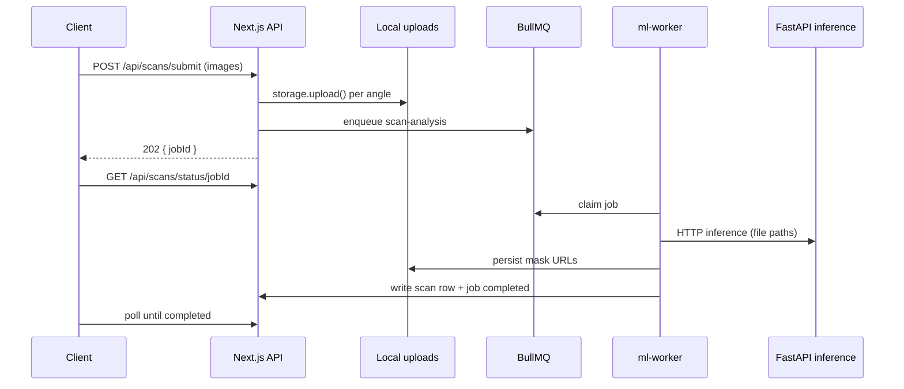

# Skinfit local infrastructure architecture

Production-shaped layout that runs **entirely on Docker Compose** until AWS + Cloudflare billing is ready.

## Layout

```
apps/
  web/          → Next.js (root today; see apps/web/README.md)
  ml-worker/    → BullMQ consumer (Node)
docker/         → Compose + Dockerfiles
infra/          → env templates
models/         → Offline ML weights (not in git)
services/
  shared/       → storage, queue, cache, logging, notifications
  uploads/      → docs → app/api/uploads
  queue/        → docs → services/shared/queue
uploads/        → local object store (gitignored)
```

## Doctor–patient data isolation

Each clinician only sees patients linked in `doctor_patient_care` (created when an appointment is approved or booked from the doctor portal). Per pair:

- **Chat + E2EE**: `chat_threads.doctor_id` — one secure thread per doctor–patient pair (fixes “keys exist for this thread but not for this account”).
- **Scans, visits, voice notes, reports**: scoped by `doctor_id` + `user_id` (legacy rows with `doctor_id` null remain visible to the assigned doctor after migration).
- **Written feedback / visited flag**: stored on `doctor_patient_care`, not globally on `users`.
- **Patient portal**: `users.assigned_doctor_id` selects which clinician’s data the patient sees.

Doctor signup: `/doctor/signup` with `secretKey` validated against `DOCTOR_REGISTRATION_SECRET_KEY`. Run `drizzle/0032_doctor_patient_isolation.sql` before deploy.

Scheduling UI and calendar modules are unchanged in this pass.

## Async scan flow



## Environment abstraction

| Now | Later |
|-----|-------|
| `LOCAL_POSTGRES_URL` | `AWS_RDS_URL` |
| `LOCAL_REDIS_URL` | `ELASTICACHE_URL` |
| `STORAGE_DRIVER=local` | `STORAGE_DRIVER=r2` |
| Console JSON logs | CloudWatch + Sentry |

## Quick start

```bash
cp infra/.env.local.example .env.local
docker compose -f docker/docker-compose.yml up -d postgres redis
npm run db:migrate   # includes 0031_storage_urls_and_scan_jobs.sql
npm run worker:dev   # apps/ml-worker
npm run dev
```

Set `SCAN_ASYNC_MODE=1` and use `POST /api/scans/submit` instead of blocking `POST /api/scan`.
