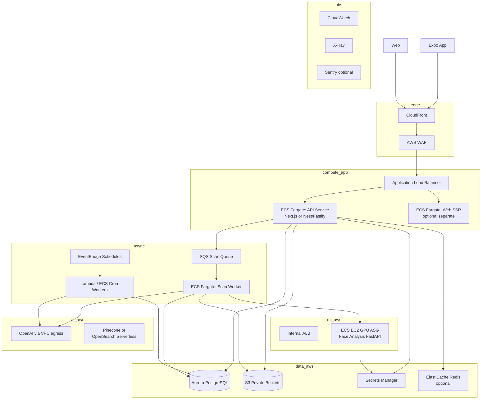
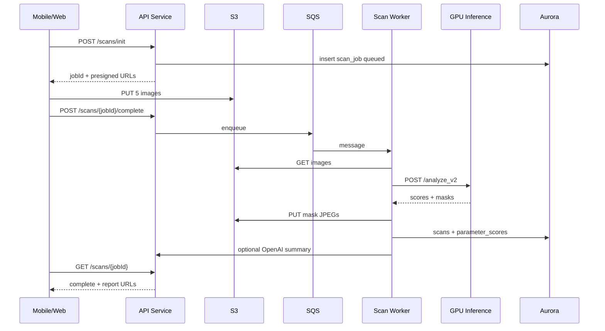
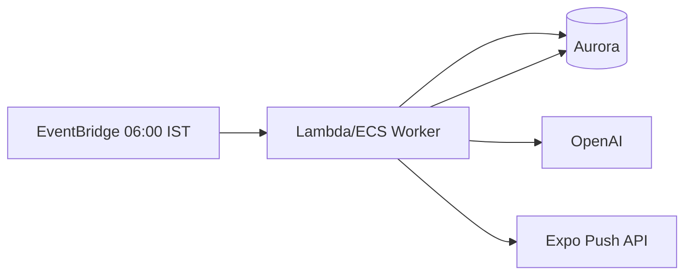

# SkinFit Clinic — Production System Design (AWS)

**Date:** May 2026  
**Classification:** Internal — SkinFit Clinic  
**Scope:** Large-scale production architecture and AWS migration plan (`skinfit-clinic` + `face_analysis_tool`)

---

Below is a **production system design** for SkinFit Clinic based on your actual codebase, written for a **large-scale AWS migration**. Treat this as an architecture baseline; several numbers depend on answers in **Section 12**.

---

## 1. Executive summary

You currently run a **monolithic Next.js backend** (web + API routes), an **Expo mobile app**, **PostgreSQL** (Neon + Drizzle), **GPU/CPU inference on Hugging Face Spaces** (FastAPI + PyTorch), and **OpenAI + Pinecone** for kAI chat/RAG. Scan images and masks are largely stored as **base64 data URIs inside Postgres** — fine for early product, **not** for large-scale production.

For AWS at scale, the core shift is:

| Today | Production target |
|--------|-------------------|
| Sync scan in one HTTP request | **Async pipeline**: upload → queue → infer → persist |
| Images in DB as data URIs | **S3** + CloudFront signed URLs |
| HF Space (shared, CPU) | **Dedicated GPU inference** (ECS on GPU or SageMaker) |
| Next.js does everything | **Split**: API service + workers + inference service |
| Cron via HTTP routes | **EventBridge + Lambda/ECS workers** |
| Single-region assumptions | **Multi-AZ**, optional multi-region later |

---

## 2. Current system (as-is)

### 2.1 Logical components

```mermaid
flowchart TB
  subgraph clients
    Web[Next.js Web App]
    Mobile[Expo Mobile App]
    Doctor[Doctor Portal]
  end

  subgraph skinfit_api [skinfit-clinic Next.js]
    API[API Routes /api/*]
    Auth[JWT Cookie + Bearer]
    Scan[/api/scan]
    Chat[/api/ai/chat]
    Cron[/api/cron/*]
  end

  subgraph data
    PG[(PostgreSQL / Neon)]
  end

  subgraph ml
    HF[HF Space FastAPI<br/>POST /analyze_v2]
  end

  subgraph ai_services
    OAI[OpenAI]
    PC[Pinecone RAG]
  end

  subgraph external
    SMTP[SMTP Email]
    Sheets[Google Sheets Webhooks]
    Expo[Expo Push]
  end

  Web --> API
  Mobile --> API
  Doctor --> API
  API --> Auth
  Scan --> HF
  Scan --> OAI
  Scan --> PG
  Chat --> OAI
  Chat --> PC
  Chat --> PG
  Cron --> PG
  Cron --> OAI
  API --> SMTP
  API --> Sheets
  API --> Expo
```

### 2.2 Core user journeys

#### A. Five-angle skin scan (critical path)

1. **Mobile/Web** captures 5 poses: `centre`, `left`, `right`, `eyes_closed`, `smiling` (see `faceScanCaptures.ts`).
2. Client POSTs multipart to **`/api/scan`**.
3. Server normalizes EXIF (`scanImagePreview.ts` / mobile `normalizeScanImage.ts`).
4. Server calls **`FACE_ANALYSIS_SERVICE_URL/analyze_v2`** with 5 files (`faceAnalysisInferenceV2.ts`), timeout up to **120s**.
5. Python service (`api_server.py`):
   - Loads **FaceAnalyzer v13** (DINOv2 ViT-L/14 frozen + cls / wrinkle seg / acne heads).
   - Uses **centre** for masks/scores; **smiling** for dynamic wrinkle proxy.
   - Returns scores, spatial outputs, overlay/mask JPEGs as **data URIs**.
6. Server optionally calls **OpenAI** for one-line `aiSummary`.
7. Server writes **`scans`** row + **`parameter_scores`** + JSON blobs (masks in `scores` JSONB).

**Bottleneck today:** one long synchronous request; DB stores megabytes of base64 per scan.

#### B. Authentication

- Custom sessions: **HTTP-only cookie (web)** + **`Authorization: Bearer` JWT (mobile)** (`get-session.ts`).
- Passwords: bcrypt in `users` table.

#### C. kAI intelligence layer

- **Patient chat**: `/api/ai/chat` → OpenAI (+ Pinecone retrieval when configured).
- **Scheduled jobs** (HTTP cron with `CRON_SECRET`):
  - Daily focus, weekly, monthly kAI reports (`cronKaiJobs.ts`).
  - Appointment reminders.

#### D. Clinic operations

- Appointments, visit notes, doctor feedback (text + **audio data URIs** in DB).
- Optional **Google Sheets webhooks** for CRM sync.
- Doctor portal for patient management.

### 2.3 Data model highlights (Postgres)

Important tables from `schema.ts`:

| Table | Purpose | Scale risk |
|-------|---------|------------|
| `users` | Patients, doctors, profile, push tokens | Low |
| `scans` | Scan results; **`image_url`, `face_capture_images`, masks in `scores`** | **High** (large TEXT/JSONB) |
| `parameter_scores` | 8 kAI parameters per scan | Medium |
| `daily_logs` | Routine, sleep, stress, hydration | Medium (row growth) |
| `chat_messages` | Clinic support / AI threads | Medium–High |
| `appointments`, visit-related | Scheduling & clinical notes | Medium |
| `skin_scans` | Legacy parallel scan store | Migration debt |

### 2.4 ML service (`face_analysis_tool`)

- **Runtime:** FastAPI + Uvicorn, Docker (currently **CPU torch** in Dockerfile).
- **Model:** ~224×224 input; wrinkle mask 224×224; acne 16×16 grid.
- **Checkpoint:** `face_analyzer_v13.pt` (heads only; backbone from `torch.hub`).
- **Auth:** optional `X-API-Key` / `FACE_ANALYSIS_API_KEY`.
- **Deployed today:** Hugging Face Space (port 7860).

### 2.5 External dependencies (env-driven)

| Variable family | Service |
|-----------------|---------|
| `DATABASE_URL` | Neon Postgres |
| `FACE_ANALYSIS_SERVICE_URL`, `FACE_ANALYSIS_SERVICE_SECRET` | Inference |
| `OPENAI_API_KEY`, embedding models | Summaries, chat, RAG LLM |
| `PINECONE_*` | Vector search |
| `CRON_SECRET` | Scheduled jobs |
| `SMTP_*` | Email |
| `CLINIC_SHEET_*_WEBHOOK` | Sheets integration |
| `EXPO_PUBLIC_API_URL` | Mobile → backend |

---

## 3. Production requirements (what “large scale” means)

Define SLOs explicitly. Example targets to discuss with your team:

| Metric | Starter prod | Large scale |
|--------|--------------|-------------|
| Concurrent scans | 10 | 500+ |
| Scans / day | 1k | 100k+ |
| Scan p95 latency (user perceived) | &lt; 15s async accepted | &lt; 8s with GPU fleet |
| API availability | 99.5% | 99.9%+ |
| RPO / RTO (DB) | 24h / 4h | 15 min / 1h |
| Data residency | India | India + export rules |

**Non-functional requirements you must document:**

- **Privacy:** facial images = sensitive personal data (India DPDP Act; if US patients, HIPAA-like controls).
- **Retention:** how long raw photos vs derived scores are kept.
- **Consent:** onboarding + scan disclaimers (not diagnosis).
- **Audit:** who accessed which patient record (doctor actions).
- **Multi-tenancy:** one clinic vs many clinics on one platform.

---

## 4. Target AWS architecture (recommended)

### 4.1 High-level (split responsibilities)



### 4.2 Why async scan pipeline (mandatory at scale)

**Today:** Client waits for inference + DB write + optional OpenAI.

**Target:**

1. `POST /api/scans` → validate auth → virus scan (optional) → **presigned S3 upload** (5 objects) → create `scan_jobs` row `status=queued` → return `jobId` immediately.
2. **SQS message** `{ jobId, userId, s3Keys[] }`.
3. **Worker** pulls message → calls internal inference → writes scores → updates `status=complete` → push notification / websocket.
4. Client polls `GET /api/scans/{jobId}` or receives **WebSocket/SSE** update.

Benefits: no API Gateway/ALB timeout issues, horizontal scaling, retry on HF-style failures, backpressure when GPU queue is full.

### 4.3 AWS service mapping (detailed)

| Capability | AWS service | Notes |
|------------|-------------|-------|
| Web hosting | **CloudFront** + **S3** (static) or **ECS/Amplify** for Next SSR | Next.js 16: consider splitting static vs SSR |
| Mobile API | Same ALB → API service | Keep Bearer JWT |
| REST API edge | **API Gateway HTTP** (optional in front of ALB) | Rate limits, API keys for partners |
| Application compute | **ECS Fargate** (stateless API + workers) | Start here; EKS only if you need K8s ecosystem |
| GPU inference | **ECS on EC2 GPU** (g5/g6 instances) ASG | Match current FastAPI container; add GPU torch image |
| Alternative ML | **SageMaker real-time endpoint** | Higher ops cost, good if MLOps team owns models |
| Database | **Aurora PostgreSQL** (Multi-AZ) | Migrate from Neon; use RDS Proxy |
| Object storage | **S3** + SSE-KMS | `raw-scans/`, `derivatives/masks/`, `audio/` |
| CDN for images | **CloudFront** + **signed URLs** | Never public patient photos |
| Secrets | **Secrets Manager** | DB creds, OpenAI, inference API key |
| IAM | **IAM roles** per task | No keys in containers |
| Queue | **SQS** standard + **DLQ** | Scan jobs, email, webhooks |
| Schedules | **EventBridge** → Lambda or ECS | Replace `/api/cron/*` |
| Cache | **ElastiCache Redis** | Sessions, rate limits, hot dashboard |
| Email | **Amazon SES** | Replace raw SMTP or keep SMTP relay |
| Push | Keep **Expo push** | Or add SNS mobile push later |
| WAF | **AWS WAF** on CloudFront/ALB | OWASP, bot control, geo block |
| Logging | **CloudWatch Logs** | Structured JSON |
| Metrics/alarms | **CloudWatch** + **SNS/PagerDuty** | GPU queue depth, scan failure rate |
| Tracing | **X-Ray** or **ADOT** | End-to-end scan latency |
| CI/CD | **GitHub Actions** → **ECR** → **ECS deploy** | Separate pipelines for app vs model |
| IaC | **Terraform** or **CDK** | Required for company governance |
| Compliance | **AWS Config**, **CloudTrail**, **KMS** | Audit who did what |
| Backup | **Aurora backups** + **S3 versioning/lifecycle** | Cross-region replication if needed |
| VPC | Private subnets for RDS, GPU, workers; public ALB only | NAT Gateway for egress to OpenAI |

### 4.4 Inference service on AWS (deep dive)

**Container:** Same `api_server.py`, but Dockerfile must use **CUDA torch** and health checks.

| Concern | Design choice |
|---------|----------------|
| Cold start | Keep **min capacity ≥ 1 GPU** in prod; scale on SQS depth |
| Model load | Load once per container; **read-only EFS** or bake checkpoint in image |
| Versioning | `FACE_ANALYSIS_CHECKPOINT` + blue/green ECS services (`v13`, `v14`) |
| Autoscaling | Custom metric: `ApproximateNumberOfMessagesVisible` on SQS |
| Timeout | Inference internal timeout 60–90s; worker visibility timeout &gt; that |
| Security | **Private ALB**, no public internet; API service only |
| Batch | Optional **SageMaker Batch** for offline reprocessing |

**GPU sizing (starting point):**

- DINOv2 ViT-L/14 + 3 heads, 5 images per request: plan **1 request ≈ 2–8s on T4/A10** depending on batching.
- Rule of thumb: **1× g5.xlarge** ≈ tens of concurrent scans/min with queue; load-test your checkpoint.

### 4.5 Application layer refactor (minimal but necessary)

Keep Next.js initially **or** extract API to Node (Hono/Fastify) — for enterprise, teams often:

| Phase | Approach |
|-------|----------|
| 1 | Next.js on ECS behind ALB (fastest migration) |
| 2 | Extract `/api/scan`, `/api/ai/*`, cron to **standalone Node API** |
| 3 | Mobile-only BFF if needed |

**Must-change code paths:**

- Stop storing `dataUri` in Postgres → store **S3 keys** + MIME + checksum.
- `imageUrl` becomes `https://cdn.../signed?...` or app proxy `GET /api/media/{id}`.
- `faceCaptureImages[]` → array of `{ label, s3Key, width, height }`.
- Migration script: backfill S3 from existing data URIs (batched).

### 4.6 Database design (production)

**Aurora PostgreSQL** (provisioned or serverless v2):

- Enable **Multi-AZ**, automated backups, **Performance Insights**.
- **RDS Proxy** for connection pooling (many ECS tasks).
- Partition or archive:
  - `chat_messages` by month
  - Old `scans` to **S3 Glacier** + metadata-only rows

**New tables suggested:**

```sql
scan_jobs (
  id uuid PK,
  user_id uuid FK,
  status enum queued|processing|complete|failed,
  s3_prefix text,
  error text,
  inference_version text,
  created_at, completed_at
)

media_objects (
  id uuid PK,
  owner_user_id uuid,
  bucket text,
  key text,
  content_type text,
  bytes bigint,
  purpose enum scan_raw|scan_mask|profile|visit_attachment,
  created_at
)
```

Keep `parameter_scores` as today — relational analytics-friendly.

### 4.7 AI / RAG layer

| Function | Today | AWS-friendly pattern |
|----------|-------|----------------------|
| Chat | OpenAI direct | Same; optionally **Bedrock** (Claude) for data residency negotiations |
| Embeddings | OpenAI | Bedrock Titan or keep OpenAI |
| Vector DB | Pinecone | **OpenSearch Serverless** (vectors) or keep Pinecone |
| RAG indexing | Local scripts | **Lambda** on S3 PDF upload → chunk → embed → index |
| kAI cron | HTTP cron | **EventBridge** rules per timezone bucket |

**Cost control:** cache embeddings; cap tokens per user/day; separate queue for LLM-heavy monthly reports.

### 4.8 Security architecture

| Layer | Control |
|-------|---------|
| Network | VPC, private RDS, SG least privilege |
| Auth | Short-lived JWT + refresh; consider **Cognito** if you want MFA/OAuth at scale |
| Encryption | S3 SSE-KMS, RDS encryption, TLS 1.2+ |
| PII | Field-level encryption for phone/email optional |
| Access | Doctor RBAC: `role` enum already exists — enforce in every API |
| Audit | `audit_log` table + CloudTrail for infra |
| App | OWASP: file upload limits, presigned URL expiry (5 min), content-type validation |
| ML | No training on prod photos without consent; separate **research account** |

**India DPDP:** data principal rights (access/delete), DPO, breach notification — architecture must support **delete user → cascade S3 + DB**.

### 4.9 Observability & operations

| Signal | What to track |
|--------|----------------|
| Business | Scans/day, completion rate, onboarding funnel |
| Scan pipeline | Queue age, failure %, GPU utilization |
| API | p50/p95 latency, 5xx rate |
| DB | Connections, slow queries, storage growth |
| ML | Model version, inference time per angle |
| LLM | Token usage per feature |

**Runbooks:** inference OOM, SQS poison messages, DB failover, rollback model version.

### 4.10 Environments

| Env | Purpose |
|-----|---------|
| `dev` | Shared, fake inference optional |
| `staging` | Full parity, anonymized data |
| `prod` | Multi-AZ, real GPU |
| `prod-dr` | Optional second region |

**Accounts:** AWS Organizations — separate accounts for prod vs non-prod (blast radius).

---

## 5. End-to-end process flows (target state)

### 5.1 Scan flow (async)



### 5.2 Doctor updates patient

Unchanged logically; ensure **visit attachments** go to S3, not `text` data URIs (you already hit size limits in places).

### 5.3 kAI daily focus cron



Shard patients by timezone (`users.timezone` already exists).

---

## 6. Migration roadmap (phased)

### Phase 0 — Discovery (2–4 weeks)

- Capacity planning workshops (Section 12).
- Threat model + data classification.
- Choose: ECS vs EKS, Cognito vs custom auth.
- Load test current HF endpoint with realistic 5-image payloads.

### Phase 1 — AWS foundation (4–6 weeks)

- AWS Organization, VPC, Aurora, S3 buckets, KMS, Secrets Manager.
- CI/CD to ECR + ECS (staging).
- Migrate Neon → Aurora (DMS or pg_dump), minimal code change.
- Deploy Next.js to ECS + CloudFront.

### Phase 2 — Media off DB (4–8 weeks) **critical**

- Presigned upload for new scans.
- Dual-write: S3 + legacy URI during transition.
- Backfill job for historical scans.
- CloudFront signed URLs in app.

### Phase 3 — Inference on AWS GPU (4–6 weeks)

- GPU Docker image, internal ALB.
- Point `FACE_ANALYSIS_SERVICE_URL` to AWS.
- Decommission or keep HF as **DR fallback** only.

### Phase 4 — Async scan pipeline (4–6 weeks)

- SQS + workers; mobile/web UX for “processing”.
- DLQ alerting, retries, idempotency keys.

### Phase 5 — Hardening & scale (ongoing)

- WAF, rate limits, Redis cache.
- OpenSearch vs Pinecone decision.
- Multi-clinic tenancy if needed.
- SOC2-style controls if enterprise clinics.

**Total realistic timeline:** **6–9 months** for a disciplined team; **3–4 months** for MVP production on AWS with sync scans + S3 + GPU (skip full async first if load is moderate).

---

## 7. Team & skills needed

| Role | Responsibility |
|------|----------------|
| **Tech lead / architect** | AWS design, ADRs, security |
| **Backend engineers (2+)** | API split, S3 migration, workers |
| **ML engineer** | GPU container, model versioning, quality regression |
| **DevOps / platform** | Terraform, ECS, monitoring, cost |
| **Mobile engineer** | Async scan UX, upload reliability |
| **Frontend engineer** | Report UI, doctor portal |
| **QA** | Scan regression suite (golden images) |
| **Compliance / legal** | DPDP, consent, clinical disclaimers |
| **On-call rotation** | After Phase 3 |

---

## 8. Cost drivers (qualitative)

Largest AWS bills at scale:

1. **GPU EC2** (24/7 min instances vs scale-to-zero).
2. **NAT Gateway** egress (OpenAI calls — consider VPC endpoints only for AWS services).
3. **Aurora storage** if you keep blobs in DB (fix S3 first).
4. **CloudFront** egress for image-heavy apps.
5. **OpenAI tokens** (often &gt; infra if chat/RAG is heavy).

**Cost optimizations:**

- S3 Intelligent-Tiering for old scans.
- Lifecycle: delete raw after N days, keep scores forever.
- Batch LLM jobs off-peak.
- Reserved instances for baseline GPU.

---

## 9. Risks & technical debt to address

| Risk | Impact | Mitigation |
|------|--------|------------|
| Data URIs in Postgres | DB bloat, slow backups, expensive | Phase 2 S3 migration |
| Sync 120s scan | Timeouts, bad UX under load | Async queue |
| CPU inference on HF | High latency at peak | GPU ASG |
| Single monolith | Deploy blast radius | Split workers + API |
| Dummy inference fallback | Regulatory/trust issue | Disable in prod (`FACE_ANALYSIS_ALLOW_DUMMY=false`) |
| Model downloads via torch.hub | Fragile deploys | Bake backbone or cache in AMI/EFS |
| No formal audit trail | Compliance gap | `audit_log` + CloudTrail |
| Roboflow legacy path | Confusion | Deprecate if unused |

---

## 10. What you need to buy/build (checklist)

### Infrastructure

- [ ] AWS accounts + IAM Identity Center
- [ ] VPC (3 AZ), NAT, subnets
- [ ] Aurora PostgreSQL + RDS Proxy
- [ ] S3 buckets + KMS keys + lifecycle policies
- [ ] ECR repositories (api, web, inference, worker)
- [ ] ECS clusters (Fargate + GPU EC2)
- [ ] ALB + CloudFront + WAF
- [ ] SQS + DLQ
- [ ] EventBridge schedules
- [ ] Secrets Manager
- [ ] CloudWatch dashboards/alarms
- [ ] Terraform/CDK repo

### Application

- [ ] Presigned upload API
- [ ] `scan_jobs` state machine
- [ ] Media URL signing service
- [ ] Worker service
- [ ] Mobile “scan processing” screen
- [ ] DB migration scripts
- [ ] Inference GPU Dockerfile
- [ ] Golden-image regression tests for v13
- [ ] Remove/disable dummy inference in prod

### Governance

- [ ] Privacy policy + consent flows
- [ ] Data retention policy
- [ ] Incident response plan
- [ ] On-call + runbooks

---

## 11. Questions I need from you (please answer)

These determine sizing and architecture forks:

### Business & scale

1. **Expected users:** MAU, DAU, and **scans per day** at 12 months?
2. **Peak concurrency:** max simultaneous scans (e.g. marketing campaign)?
3. **Clinic model:** single clinic or **multi-tenant SaaS** (many clinics)?
4. **Geography:** India only or international? (data residency)
5. **SLA:** Is **&lt;10s** result required, or is “ready in 30–60s with notification” OK?

### Compliance & legal

6. **Regulatory scope:** India DPDP only, or HIPAA / EU GDPR too?
7. **Can you store photos in AWS Mumbai (`ap-south-1`)?** Any requirement to avoid US regions for PII?
8. **Retention:** How long keep **raw** photos vs **scores only**?
9. **Human review:** Do clinicians need to download/export full images?

### Product & technical

10. **Auth roadmap:** Stay custom JWT, or **Cognito** / enterprise SSO for clinic staff?
11. **OpenAI:** Must stay OpenAI, or open to **AWS Bedrock**?
12. **Pinecone:** Keep or move vectors to **OpenSearch**?
13. **Real-time features:** Live scan guidance on device (future) — edge ML needed?
14. **Offline/mobile:** Must scans work with poor network (resumable uploads)?
15. **Budget range** for monthly infra (order of magnitude: $2k / $20k / $100k)?

### Organization

16. **Team size** today for backend/DevOps/ML?
17. **Timeline** for go-live on AWS?
18. **Downtime tolerance** for DB migration?

---

## 12. Recommended decision (if you want a default path)

For a **dermatology clinic product scaling in India** with your current stack:

1. **Region:** `ap-south-1` (Mumbai).
2. **App:** Next.js API on **ECS Fargate** behind ALB + CloudFront (fastest migration).
3. **ML:** Same FastAPI on **ECS GPU (g5)** with internal ALB; retire public HF in prod.
4. **Data:** **Aurora PostgreSQL** + **S3** for all images/audio; signed CloudFront URLs.
5. **Scans:** Introduce **SQS async pipeline** before you hit ~500+ scans/day.
6. **Cron:** **EventBridge** workers, not HTTP `/api/cron`.
7. **Auth:** Keep JWT short-term; plan **Cognito** when you add clinic SSO/MFA.
8. **Observability:** CloudWatch + Sentry from day one in prod.

---

## 13. Immediate next steps (practical)

1. **Answer Section 11** (even rough numbers).
2. Run a **load test** on current `/analyze_v2` (5× JPEG) and record p50/p95 on CPU vs one GPU instance.
3. **Measure DB size** per scan row (average `scans` + JSONB) — this justifies S3 migration priority.
4. Create an **ADR doc** (Architecture Decision Record) for: async vs sync, Cognito vs custom, Bedrock vs OpenAI.
5. Stand up **staging AWS** with Aurora + S3 + one GPU instance before touching prod Neon.

---

I can turn this into a **formal ADR pack** (diagrams + Terraform module list + sprint breakdown) once you answer the questions in **Section 11** — especially **scans/day**, **region**, **compliance**, and **async SLA**.

If you want, reply with:
- MAU / scans per day (estimate),
- India-only or global,
- budget tier,
- target go-live date,

and I’ll produce **Phase 1 Terraform module outline** and a **week-by-week implementation plan** tailored to your numbers.

[REDACTED]